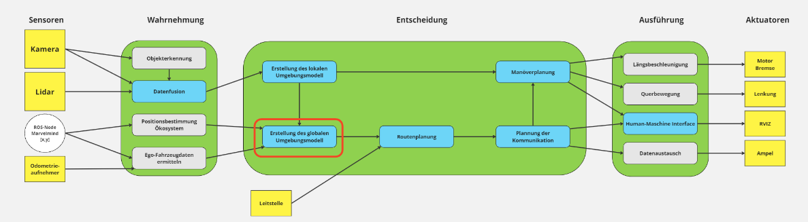
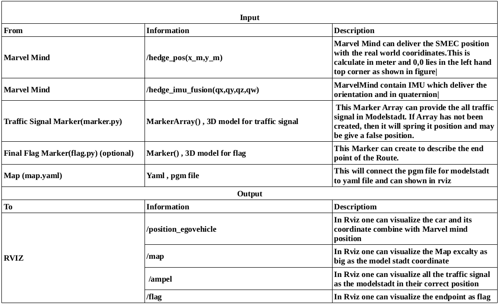
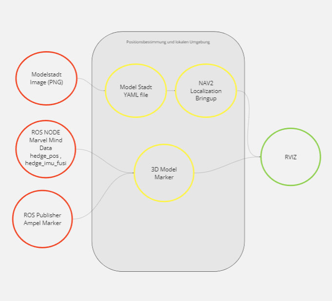
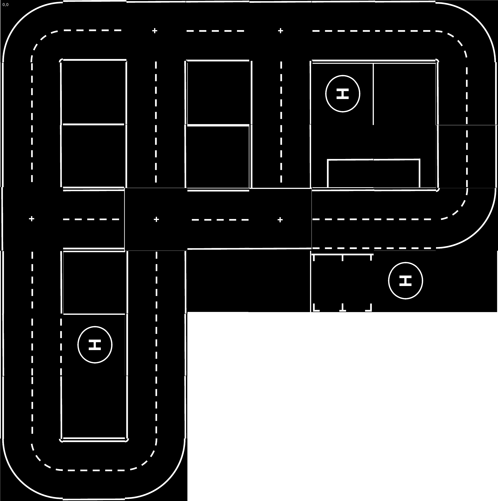
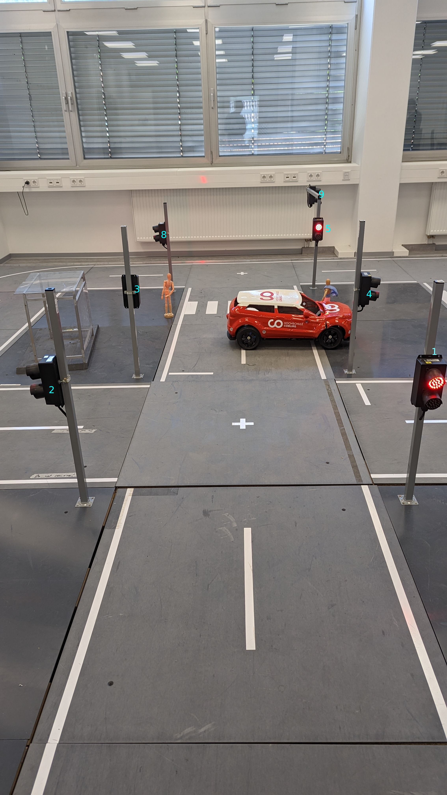

This is repo orignally created by Mustafa Das. It need many change, so I have add the actual Map from Model Stadt with excaltly big as we need. Car Visulization is also changed.

# Mapping and Position in Map  :writing_hand:
This repository contains instructions on how to show map and position a car in Rviz2 using the Marvel Mind system 

# Introduction :open_book:
Welcome to our repository for visualizing the position of a Model Car using Marvel Mind technology. Here, we have developed a car marker and a map to enhance the tracking experience. Additionally, you will find various components such as static markers representing model city elements like traffic signals and Endposition as Flag. 

# Requirement :link:
- A car that is connected to a Marvel Mind system
- Working Beakons and Marvel Mind which deliver the hedge_pos and hedge_imu_fusion
- Marvel Mind Repo –
```
  https://git.hs-coburg.de/Autonomous_Driving/ros_marvelmind_package.git 
```
- A Computer with Ubuntu 20.04 and ROS2 
- Mapping Repository-
``` 
  https://git.hs-coburg.de/Autonomous_Driving/model_city_map.git
```
- Rviz2, mit Nav2 und TF2 , When not install, please refer to belowe websites-
```
  https://navigation.ros.org/getting_started/index.html  
```
```
https://docs.ros.org/en/foxy/Tutorials/Intermediate/Tf2/Introduction-To-Tf2.html
```
  
- (optional) When you need to see Static Marker in Modelstadt refer - 
```
git@git.hs-coburg.de:SMEC/static_marker.git
```
- (optional) When you want to see a Endpoint then refer to - 
```
git@git.hs-coburg.de:ris2815s/flag_model.git
```

# Component Description :scroll: 
The following diagram will represent the Architecture of SMEC system, in which one can see Component in red box.



 The Position of SMEC and its Orientation in Map is very important and to 
responsible for the visualization on real time position in Map. In last Module 4 we have seen the implementation of Positon and Orientation, But it is unstable. 
To better understand the functions of the component, it is necessary to briefly explain the steps required to ensure communication according to the standards set for V2X communication. The following sequence diagram shows the communication between the MarvelMind and SMEC.

In global environment as shown in above architecture, we receive the signal from marvel Mind to define our Position and Orientation, and we send our endlocation to plan the Route. Here one can see, all the static Object for example Traffic light or House type object. To define the Interface, please read the next topic.


# Description of the interfaces :black_nib:
Message for the visulaize position and map for modelstadt ,for the interface to rviz. These message may be photo of map or the position from marvel mind x,y and Imu data qz for orientation.

The following table will describe the Interface for the repository-



# Planning and Implementation :spider_web:
This part explains what was actually done to realize the functions of the component from basic to implementation.



1)**Map**- A map is a visual representation of a physical or conceptual space, providing a simplified depiction of its features, such as terrain, roads, landmarks, or abstract relationships. It serves as a valuable tool for navigation, spatial understanding, and analysis.There are two type of maps that we can used, a topological map or a satellite map. A topological map is a specialized type of map that focuses on the relationships and connectivity between different locations or features.A satellite map displays Earth's surface from above, utilizing satellite imagery to provide detailed views of landscapes, cities, and geographical features. As our modelstadt is inside and not much big, we use a topological map. As seen below, it is the map for our modelstadt. But It can not be shown in rviz. For Rviz we need a .pgm file. And to convert this to pgm we need to convert a .png file of map to binary and then to pgm. for this step please check following repository 
```
git@git.hs-coburg.de:Autonomous_Driving/model_city_map.git
```


2)**Position** - In Modelstadt, the position of the car can be categorized into two types: static and dynamic.
- Static Position: When the car is in a static position, it means that it is stationary and not in motion. It remains in a stable condition at a fixed location within the Modelstadt environment.
- Dynamic Position: On the other hand, a dynamic position refers to the car's movement within Modelstadt. As the car navigates through the simulated city, its position constantly changes. This dynamic position is represented by the coordinates (x_m, y_m) in the Marvel Mind system. These coordinates provide real-time information about the car's current location within the Modelstadt map.

To visualize and display the car's position, the ROS Marker functionality is employed. ROS Markers are used to generate visual markers in ROS, including Rviz, which is a visualization tool commonly used in robotics and autonomous systems development.By utilizing ROS Markers, the car's position can be visually represented in 3D in Rviz through markers that indicate the current coordinates of the car within the Modelstadt environment. These markers can be dynamically updated as the car's position changes, allowing for real-time visualization of the car's movement within the Modelstadt. By leveraging the combination of dynamic position coordinates (x_m, y_m) in the Marvel Mind system and ROS Markers in Rviz, one can effectively monitor and visualize the car's position and movement in Modelstadt during autonomous driving simulations or testing scenarios.

3)**Orientation** - In Modelstadt, as the car moves, its orientation changes along the z-axis, which represents the vertical axis or the heading direction. To accurately capture and determine the car's orientation, an IMU (Inertial Measurement Unit) is connected to the car. As the rotation around x and y (roll, pitch) is zero.An IMU is a sensor device that combines multiple sensors, such as accelerometers, gyroscopes, and magnetometers, to measure various aspects of the car's motion and orientation. In this case, the IMU is specifically used to capture the changes in the car's orientation along the z-axis. The IMU continuously provides data about the car's angular velocity and acceleration, which allows us to calculate and track the car's current orientation accurately. By integrating the data from the IMU, we can determine the car's heading or the direction it is facing at any given moment.ROS Markers in Rviz support the rotation parameter, which can be used to set the orientation of a marker in the 3D space. By updating this rotation parameter with the orientation data obtained from the IMU, the marker representing the car can accurately reflect its current orientation in the simulation.
By combining the data from the IMU and updating the orientation of the ROS Marker, we can effectively visualize and track the car's changing orientation as it moves within the Modelstadt environment during autonomous driving simulations or testing scenarios.

4)**Traffic Signals and Final Point** - In Modelstadt, traffic signals are an important component of the simulated city environment. To represent these traffic signals in ROS , we utilize ROS Markers.
Each traffic signal in Modelstadt is assigned a unique number from 1 to 9, corresponding to its identification. To visualize all the traffic signal markers simultaneously, we make use of a Marker Array. A Marker Array is a data structure that allows multiple markers to be grouped together and managed as a single entity. By appending individual markers representing each traffic signal to the Marker Array, we can generate the complete set of traffic signal markers. This approach enables us to efficiently manage and update the markers collectively.
When visualizing the traffic signal markers, it is important to ensure that their size and orientation accurately match those in the Modelstadt environment. By aligning the markers' size and orientation with the actual traffic signals, we can provide an accurate representation of the traffic control devices in the simulation. Similar to Final Flag. It provide the information of End point after the Route is planned. For more information regrading this marker and usage , check the following git repository
```
git@git.hs-coburg.de:SMEC/static_marker.git
```
```
git@git.hs-coburg.de:ris2815s/flag_model.git
```




# Step to follow :footprints: 
 - Make sure the Marvel Mind system is properly connected to the car or Jetson and working.
 - Connect the Marvel Mind system to your Jetson by connecting the USB cable to the Marvel Mind system and connecting the other end to your Jetson. And Run the code    
```
ros2 launch marvelmind_nav marvel_driver_launch.py
```
- Check the following things and make sure you get correct position and imu data.
```
ros2 topic list 
ros2 topic echo /hedge_pos
```
- If you get the correct position from Marvel Mind then it works, otherwise please see troubleshooting.
- Clone the following Repository in Jetson or Computer -
```
git clone https://git.hs-coburg.de/SMEC/map_und_pos.git
```
- When you want to see the car in RVIZ2 then 
```
source install/setup.bash
ros2 run pose2car posetocar
```
- Go to new Terminal and give the following code to see map 
```
source install/setup.bash
ros2 launch nav2_bringup localization_launch.py map:='path/to/map.yaml'
```
- If you are not able to visulize the map and Marker then, 
 Add -> By Topic -> Map and  Marker
- If you are not able to see Map in RVIZ2 then make sure your frame ID is map and rerun the program.    
- To see Traffic signal at their position can go to 
cd marker
```
python3 marker.py
```
- Or for the Traffic signal you can check the following repository.    
```
git@git.hs-coburg.de:SMEC/static_marker.git
```
# Demo :movie_camera:

For Demo, please check the video in demo file.

# Troubleshooting :hammer_and_wrench:
- If the mapping program gives error messages, check the connection between your Jetson and the Marvel Mind system.
- If the position of the car is not shown on the map, check the connection between the Marvel Mind system and Jetson.
- If you don't see the car in RVIz, check if the path, coordinates of MarvelMind, size, and color in pose2car.py is correct
- If you can't see the map, check if the yaml file has the correct path and size
- If the Traffic signal jump from one position to another, make sure about Marker Array and node.
